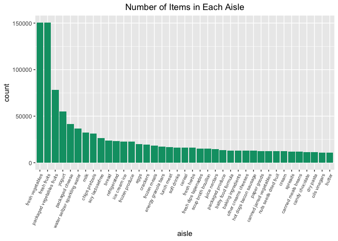
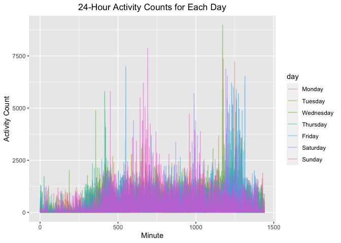
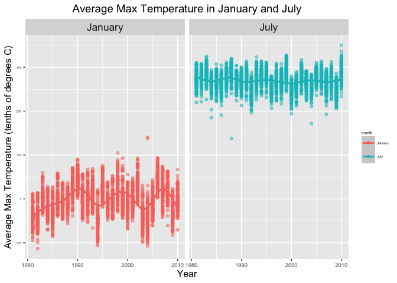
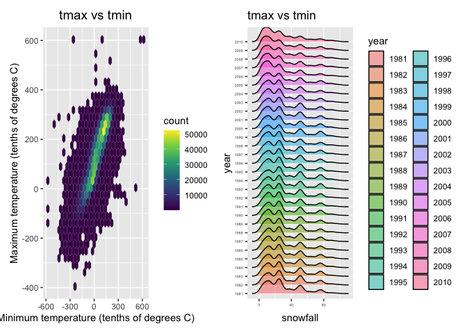

P8105_HW3
================
Meng Fang
2022-10-6

## Package Loading

``` r
library(p8105.datasets)
library(tidyverse)
```

    ## ── Attaching packages ─────────────────────────────────────── tidyverse 1.3.2 ──
    ## ✔ ggplot2 3.3.5     ✔ purrr   0.3.4
    ## ✔ tibble  3.1.6     ✔ dplyr   1.0.7
    ## ✔ tidyr   1.1.4     ✔ stringr 1.4.0
    ## ✔ readr   2.1.2     ✔ forcats 0.5.1
    ## ── Conflicts ────────────────────────────────────────── tidyverse_conflicts() ──
    ## ✖ dplyr::filter() masks stats::filter()
    ## ✖ dplyr::lag()    masks stats::lag()

``` r
library(dplyr)
library(patchwork)
library(ggridges)
```

## Problem 1

``` r
data("instacart")
insta <- instacart %>% as_tibble(instacart)
head(insta)
```

    ## # A tibble: 6 × 15
    ##   order_id product_id add_to_cart_order reordered user_id eval_set order_number
    ##      <int>      <int>             <int>     <int>   <int> <chr>           <int>
    ## 1        1      49302                 1         1  112108 train               4
    ## 2        1      11109                 2         1  112108 train               4
    ## 3        1      10246                 3         0  112108 train               4
    ## 4        1      49683                 4         0  112108 train               4
    ## 5        1      43633                 5         1  112108 train               4
    ## 6        1      13176                 6         0  112108 train               4
    ## # … with 8 more variables: order_dow <int>, order_hour_of_day <int>,
    ## #   days_since_prior_order <int>, product_name <chr>, aisle_id <int>,
    ## #   department_id <int>, aisle <chr>, department <chr>

#### How many aisles are there, and which aisles are the most items ordered from?

``` r
insta %>% group_by(aisle) %>%
  summarise(count = n()) %>%
  arrange(desc(count))
```

    ## # A tibble: 134 × 2
    ##    aisle                          count
    ##    <chr>                          <int>
    ##  1 fresh vegetables              150609
    ##  2 fresh fruits                  150473
    ##  3 packaged vegetables fruits     78493
    ##  4 yogurt                         55240
    ##  5 packaged cheese                41699
    ##  6 water seltzer sparkling water  36617
    ##  7 milk                           32644
    ##  8 chips pretzels                 31269
    ##  9 soy lactosefree                26240
    ## 10 bread                          23635
    ## # … with 124 more rows

We can see that the fresh vegetable aisle is the one that most items
ordered from.

#### Make a plot that shows the number of items ordered in each aisle, limiting this to aisles with more than 10000 items ordered. Arrange aisles sensibly, and organize your plot so others can read it.

``` r
insta %>% group_by(aisle) %>%
  summarise(count = n()) %>%
  filter(count > 10000) %>%
  arrange(desc(count)) %>%
  ggplot(aes(x = reorder(aisle,-count), y = count)) +
  geom_bar(stat = "identity", fill = "#009E73") +
  labs(x = "aisle",
       title = "Number of Items in Each Aisle" ) +
  theme(axis.text.x = element_text(angle = 65, size = 7, hjust = 1), 
        plot.title = element_text(hjust = 0.5))
```

<!-- -->

#### Make a table showing the three most popular items in each of the aisles “baking ingredients”, “dog food care”, and “packaged vegetables fruits”. Include the number of times each item is ordered in your table.

``` r
insta %>% 
  filter(aisle == c("baking ingredients", "dog food care", "packaged vegetables fruits")) %>%
  group_by(aisle, product_name) %>%
  summarise(count = n()) %>%
  arrange(desc(count)) %>%
  mutate(rank = min_rank(-count)) %>%
  filter(rank %in% 1:3) %>%
  knitr::kable()
```

    ## `summarise()` has grouped output by 'aisle'. You can override using the
    ## `.groups` argument.

| aisle                      | product_name                                    | count | rank |
|:---------------------------|:------------------------------------------------|------:|-----:|
| packaged vegetables fruits | Organic Baby Spinach                            |  3324 |    1 |
| packaged vegetables fruits | Organic Raspberries                             |  1920 |    2 |
| packaged vegetables fruits | Organic Blueberries                             |  1692 |    3 |
| baking ingredients         | Light Brown Sugar                               |   157 |    1 |
| baking ingredients         | Pure Baking Soda                                |   140 |    2 |
| baking ingredients         | Organic Vanilla Extract                         |   122 |    3 |
| dog food care              | Organix Grain Free Chicken & Vegetable Dog Food |    14 |    1 |
| dog food care              | Organix Chicken & Brown Rice Recipe             |    13 |    2 |
| dog food care              | Original Dry Dog                                |     9 |    3 |

#### Make a table showing the mean hour of the day at which Pink Lady Apples and Coffee Ice Cream are ordered on each day of the week; format this table for human readers (i.e. produce a 2 x 7 table).

``` r
insta %>% 
  filter(product_name == c("Pink Lady Apples", "Coffee Ice Cream")) %>%
  group_by(product_name, order_dow) %>%
  summarise(mean_hour = mean(order_hour_of_day)) %>%
  mutate(order_dow = recode(order_dow,
    "0" = "Monday",
    "1" = "Tuesday",
    "2" = "Wednesday",
    "3" = "Thursday",
    "4" = "Friday",
    "5" = "Saturday",
    "6" = "Sunday"
  ) 
  ) %>% pivot_wider(names_from = product_name, values_from = mean_hour) %>%
  as.data.frame()%>%t()%>% knitr::kable()
```

    ## Warning in product_name == c("Pink Lady Apples", "Coffee Ice Cream"): longer
    ## object length is not a multiple of shorter object length

    ## `summarise()` has grouped output by 'product_name'. You can override using the
    ## `.groups` argument.

|                  |          |          |           |          |          |          |          |
|:-----------------|:---------|:---------|:----------|:---------|:---------|:---------|:---------|
| order_dow        | Monday   | Tuesday  | Wednesday | Thursday | Friday   | Saturday | Sunday   |
| Coffee Ice Cream | 13.22222 | 15.00000 | 15.33333  | 15.40000 | 15.16667 | 10.33333 | 12.35294 |
| Pink Lady Apples | 12.25000 | 11.67857 | 12.00000  | 13.93750 | 11.90909 | 13.86957 | 11.55556 |

## Problem 2

``` r
accel <- read_csv(file = "./accel_data.csv") %>% janitor::clean_names()
```

    ## Rows: 35 Columns: 1443
    ## ── Column specification ────────────────────────────────────────────────────────
    ## Delimiter: ","
    ## chr    (1): day
    ## dbl (1442): week, day_id, activity.1, activity.2, activity.3, activity.4, ac...
    ## 
    ## ℹ Use `spec()` to retrieve the full column specification for this data.
    ## ℹ Specify the column types or set `show_col_types = FALSE` to quiet this message.

#### Load, tidy, and otherwise wrangle the data. Your final dataset should include all originally observed variables and values; have useful variable names; include a weekday vs weekend variable; and encode data with reasonable variable classes. Describe the resulting dataset (e.g. what variables exist, how many observations, etc).

-   Add a variable indicating whether the day is weekend or weekday.

``` r
tidy_accel <- accel %>%
  mutate(wke_wkd = ifelse((day == "Saturday"| day =="Sunday"), "weekend", "weekday"),
         day = factor(day, levels = c("Monday","Tuesday","Wednesday","Thursday","Friday","Saturday","Sunday"))
         ) %>%
  pivot_longer(4:1443, names_to = "minute", values_to = "activity_counts") %>%
  mutate(minute = as.integer(sub("activity_","",minute))) %>%
           arrange(week, day)
```

The tidied dataset is has 50400 rows and 6 colomns. The following
variables exist in this dataset.

-   week
-   day_id
-   day
-   wke_wkd (weekday vs weekend variable)
-   minute
-   acitivity_counts

### Traditional analyses of accelerometer data focus on the total activity over the day. Using your tidied dataset, aggregate across minutes to create a total activity variable for each day, and create a table showing these totals. Are any trends apparent?

-   Add the total activity together for each day, create variable
    `activity_total`.

``` r
tidy_accel %>% group_by(week, day) %>%
  summarize(activity_total = sum(activity_counts)) %>%
  pivot_wider(names_from = day, values_from = activity_total) %>%
  knitr::kable()
```

    ## `summarise()` has grouped output by 'week'. You can override using the `.groups`
    ## argument.

| week |    Monday |  Tuesday | Wednesday | Thursday |   Friday | Saturday | Sunday |
|-----:|----------:|---------:|----------:|---------:|---------:|---------:|-------:|
|    1 |  78828.07 | 307094.2 |    340115 | 355923.6 | 480542.6 |   376254 | 631105 |
|    2 | 295431.00 | 423245.0 |    440962 | 474048.0 | 568839.0 |   607175 | 422018 |
|    3 | 685910.00 | 381507.0 |    468869 | 371230.0 | 467420.0 |   382928 | 467052 |
|    4 | 409450.00 | 319568.0 |    434460 | 340291.0 | 154049.0 |     1440 | 260617 |
|    5 | 389080.00 | 367824.0 |    445366 | 549658.0 | 620860.0 |     1440 | 138421 |

We don’t observe a clear pattern on the table. But we observe two 1440
count on Saturday, which means for every minute the activity count is 1.
This is unusual and maybe the patient didn’t record data on these two
specific day.

#### Accelerometer data allows the inspection activity over the course of the day. Make a single-panel plot that shows the 24-hour activity time courses for each day and use color to indicate day of the week. Describe in words any patterns or conclusions you can make based on this graph.

``` r
tidy_accel %>%
  ggplot(aes(x = minute, y = activity_counts, color = day))+
  geom_line(alpha = 0.5)+
  labs(
    title = "24-Hour Activity Counts for Each Day",
    x = "Minute",
    y = "Activity Count"
  ) + 
  theme(plot.title = element_text(hjust = 0.5))
```

<!-- -->

We can see a pattern that there are two activity peaks: one around 750
min and one around 1250min in a day.

## Problem 3

``` r
library(p8105.datasets)
data("ny_noaa")
```

#### Do some data cleaning. Create separate variables for year, month, and day. Ensure observations for temperature, precipitation, and snowfall are given in reasonable units. For snowfall, what are the most commonly observed values? Why?

``` r
tidy_noaa <- ny_noaa %>%
  separate(date, into = c("year","month","day"), sep = "-") %>%
  mutate(prcp = as.numeric(prcp), 
         snow = as.numeric(snow), 
         snwd = as.numeric(snwd), 
         tmax = as.numeric(tmax), 
         tmin = as.numeric(tmin),
         month = month.name[as.integer(month)],
         year = as.integer(year))
```

-   Find the most commonly observed value for snowfall

``` r
tidy_noaa %>%
  group_by(snow)%>%
  summarise(count = n())%>%
  arrange(desc(count))
```

    ## # A tibble: 282 × 2
    ##     snow   count
    ##    <dbl>   <int>
    ##  1     0 2008508
    ##  2    NA  381221
    ##  3    25   31022
    ##  4    13   23095
    ##  5    51   18274
    ##  6    76   10173
    ##  7     8    9962
    ##  8     5    9748
    ##  9    38    9197
    ## 10     3    8790
    ## # … with 272 more rows

Grouping by the snowfall values, we can see that the most frequent
observation for snowfall is 0mm.

### Make a two-panel plot showing the average max temperature in January and in July in each station across years. Is there any observable / interpretable structure? Any outliers?

``` r
tidy_noaa %>%
  filter(month == c("January","July")) %>%
  group_by(month,id, year) %>%
  summarize(mean_tmax = mean(tmax, na.rm = TRUE)) %>%
  ggplot(aes(x = year, y = mean_tmax,color = month)) +
  geom_point(alpha = 0.5) +
  geom_smooth() +
  facet_wrap(~ month) +
  labs(
    x = "Year",
    y = "Average Max Temperature (tenths of degrees C)",
    title = "Average Max Temperature in January and July"
  )+
  theme(text = element_text(size = 5),
    axis.text.x = element_text(size = 7),
    axis.title = element_text(size = 12),
    strip.text.x = element_text(size = 13),
    plot.title = element_text(size = 14, hjust = 0.5)
    ) 
```

    ## `summarise()` has grouped output by 'month', 'id'. You can override using the `.groups` argument.
    ## `geom_smooth()` using method = 'gam' and formula 'y ~ s(x, bs = "cs")'

    ## Warning: Removed 5972 rows containing non-finite values (stat_smooth).

    ## Warning: Removed 5972 rows containing missing values (geom_point).

<!-- -->

We can see that the average max temperature for each station across
years has a wave-like pattern. After some years of increase in average
max temperature, we can see a dicrease in the max temperature and then
an increase again after some time. For average max temperature in
January, there is an apparent outlier in 1982, where the average max
temperature is about -110 tens of degrees C. For average max temperature
in July, there is an apparent outlier in 1988, where the average max
temperature is about 140 tens of degrees C.

#### Make a two-panel plot showing (i) tmax vs tmin for the full dataset (note that a scatterplot may not be the best option); and (ii) make a plot showing the distribution of snowfall values greater than 0 and less than 100 separately by year.

1)  tmax vs tmin for the full dataset

``` r
tmax_tmin <- tidy_noaa %>%
  ggplot(aes(x = tmin, y = tmax)) +
  geom_hex() +
  scale_fill_continuous(type = "viridis") +
  labs(
    x = "Minimum temperature (tenths of degrees C)",
    y = "Maximum temperature (tenths of degrees C)"
  ) +
  labs(title = "tmax vs tmin") +
  theme(
    plot.title = element_text(size = 14, hjust = 0.5)
  )

sf_dist <- tidy_noaa %>%
  filter(snow > 0 & snow <= 100) %>%
  mutate(year = as.factor(year)) %>%
  ggplot(aes(x = snow, y = year, fill = year)) +
  geom_density_ridges(alpha = 0.5) +
  labs(title = "tmax vs tmin",
       x = "snowfall") + 
  theme(
    axis.text.x = element_text(size = 4),
    axis.text.y = element_text(size = 4),
    axis.text.x.top = element_text(size = 3)
  )

tmax_tmin + sf_dist
```

    ## Warning: Removed 1136276 rows containing non-finite values (stat_binhex).

    ## Picking joint bandwidth of 3.76

<!-- -->

We can see that for every year, the observed snowfall values follows a
similar pattern, where the most observed snowfall value is about 0-40mm.
However, we can see an increase in counts of snowfall value between
0-40mm from 2007-2010, which indicates that we may have more snows
comparing to previous years.
